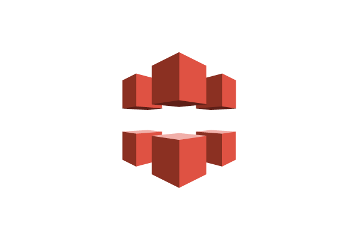

# Network Architecture and Connectivity:

  

## Introduction to the Section:

* Welcome to Section Network Architecture and Connectivity, a cornerstone of the AWS Certified Solutions Architect journey. 

* This module is designed to equip you with the fundamental knowledge and practical skills required to design robust, scalable, secure, and highly available network solutions on Amazon Web Services (AWS). 

* Understanding how AWS networking services interact and how to properly configure them is crucial for building any effective cloud infrastructure.

* In this Section, we will explore the core concepts of cloud networking, focusing on how to establish virtual networks, connect them to on-premises environments, manage traffic flow, and ensure the security and performance of your applications across the AWS global infrastructure. 

* We'll delve into the specific AWS services that empower you to build sophisticated network architectures, from isolated private networks to global content delivery solutions.

## Key AWS Services for Network Architecture and Connectivity:

This section provides a brief introduction to the essential AWS services covered in this module, which are vital for designing and implementing network solutions.

### Amazon Virtual Private Cloud (VPC):

  

* Amazon VPC allows you to provision a logically isolated section of the AWS Cloud where you can launch AWS resources in a virtual network that you define. 

* It gives you complete control over your virtual networking environment, including selection of your own IP address range, creation of subnets, and configuration of route tables, network gateways, and security settings.

#### Key Concepts:

* **CIDR Blocks:** Define the IP address range for your VPC and subnets.

* **Subnets:** Subdivisions of your VPC, logically isolated within an Availability Zone. Can be public (with direct internet access) or private (without direct internet access).

* **Route Tables:** Control how traffic is routed within your VPC and to external destinations.

* **Internet Gateway (IGW):** Enables communication between instances in your VPC and the internet.

* **NAT Gateway (Network Address Translation Gateway):** Allows instances in a private subnet to connect to the internet or other AWS services, while preventing inbound connections from the internet.

* **Network Access Control Lists (NACLs):** Stateless packet filters that operate at the subnet level, providing an additional layer of security.

* **Security Groups:** Stateful firewalls that operate at the instance level, controlling inbound and outbound traffic for EC2 instances.

### AWS Direct Connect:

  

* AWS Direct Connect is a networking service that provides a dedicated network connection from your on-premises data center, office, or colocation environment directly to AWS. 

* By bypassing the public internet, Direct Connect helps reduce network costs, increase bandwidth throughput, and provide a more consistent network experience, making it ideal for hybrid cloud architectures.

#### Key Concepts:

* **Dedicated Connection:** A physical Ethernet connection dedicated to a single customer.

* **Hosted Connection:** A connection provisioned by an AWS Direct Connect Partner and shared with multiple customers.

* **Virtual Interface (VIF):** A logical interface created over a Direct Connect connection. Can be private (for VPC connectivity), public (for public AWS services), or transit (for AWS Transit Gateway).

* **Direct Connect Gateway:** A globally available resource that allows you to connect your on-premises network to multiple VPCs across different AWS Regions or accounts using a single Direct Connect connection.

### AWS Transit Gateway:

  

* AWS Transit Gateway acts as a central hub that connects your Amazon Virtual Private Clouds (VPCs) and on-premises networks through a single gateway. 

* It simplifies your network architecture, reduces operational overhead, and enables centralized management of routing policies, especially for complex, multi-VPC, and multi-account environments.

#### Key Concepts:

* **Centralized Hub:** Simplifies connectivity between numerous VPCs, VPNs, and Direct Connect connections.

* **Attachments:** Connections between the Transit Gateway and your VPCs, VPNs, or Direct Connect gateways.

* **Transit Gateway Route Tables:** Control how traffic is routed between the attached networks.

* **Scalability:** Easily scales to support thousands of network connections.

### Amazon Route 53:

  

* Amazon Route 53 is a highly available and scalable cloud Domain Name System (DNS) web service. 

* It is designed to give developers and businesses an extremely reliable and cost-effective way to route end users to Internet applications by translating human-readable domain names (like www.example.com) into the numeric IP addresses (like 192.0.2.1) that computers use to connect to each other.

#### Key Concepts:

* **Domain Registration:** Register and manage domain names.

* **DNS Service:** Resolves domain names to IP addresses.

* **Traffic Flow:** Advanced routing policies (e.g., latency-based routing, geo DNS, weighted round robin, failover) to direct traffic to optimal endpoints.

* **Health Checks:** Monitor the health of your resources and automatically reroute traffic away from unhealthy endpoints.

### AWS VPN (Virtual Private Network):

  

* AWS VPN provides secure and private connections between your on-premises networks, remote offices, client devices, and the AWS Cloud over the public internet. 

* It comprises two main services: AWS Site-to-Site VPN and AWS Client VPN.

#### Key Concepts:

* **AWS Site-to-Site VPN:** Creates an encrypted tunnel between your on-premises network and an Amazon VPC or AWS Transit Gateway. Ideal for connecting data centers or branch offices to AWS.

* **AWS Client VPN:** A fully managed VPN service that enables your remote workforce to securely access AWS resources and on-premises networks.

* **Virtual Private Gateway (VGW):** The VPN concentrator on the AWS side of a Site-to-Site VPN connection.

* **Customer Gateway (CGW):** Your end of the VPN connection, typically a physical or software appliance on your network.

### Elastic Load Balancing (ELB):

  

* Elastic Load Balancing automatically distributes incoming application traffic across multiple targets, such as Amazon EC2 instances, containers, IP addresses, and Lambda functions, in one or more Availability Zones. 

* It helps improve the scalability, availability, and fault tolerance of your applications.

#### Key Concepts:

**Load Balancer Types:**

* **Application Load Balancer (ALB):** Best suited for HTTP/HTTPS traffic, providing advanced request routing.

* **Network Load Balancer (NLB):** Ideal for high-performance, low-latency TCP, UDP, and TLS traffic.

* **Gateway Load Balancer (GLB):** Used to deploy, manage, and scale virtual appliances like firewalls, intrusion detection systems, and deep packet inspection systems.

* **Classic Load Balancer (CLB):** A legacy option for basic load balancing of HTTP/HTTPS and TCP traffic.

* **Listeners:** Check for connection requests from clients, using the protocol and port that you configure.

* **Target Groups:** Route requests to one or more registered targets.

* **Health Checks:** Monitor the health of targets to ensure traffic is only sent to healthy instances.

### Amazon CloudFront:

  

* Amazon CloudFront is a fast and secure Content Delivery Network (CDN) service that globally distributes your content, including web assets (HTML, CSS, JS, images), video, and APIs. By caching content at edge locations worldwide, CloudFront reduces latency and improves the performance and user experience for your applications.

#### Key Concepts:

* **Edge Locations:** Strategically positioned data centers globally where CloudFront caches content, bringing it closer to your users.

* **Distributions:** The CloudFront configuration that tells it where to fetch content (origin) and how to deliver it to users.

* **Origins:** The location where your original content is stored (e.g., Amazon S3 bucket, EC2 instance, Elastic Load Balancer).

* **Caching:** Stores copies of your content at edge locations to serve future requests faster.

