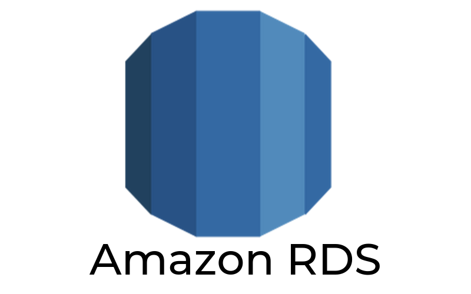
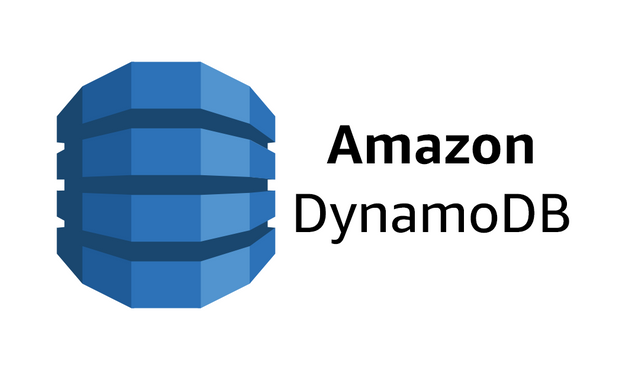
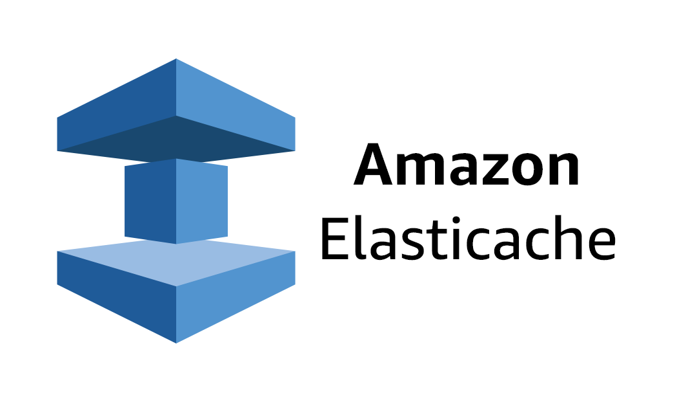
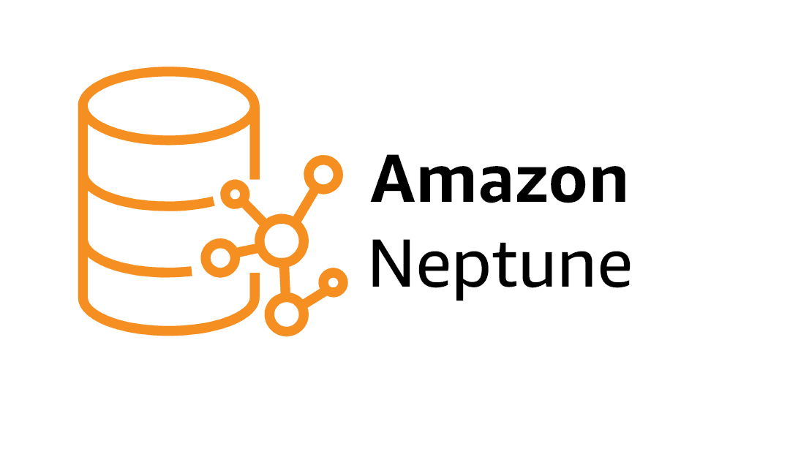
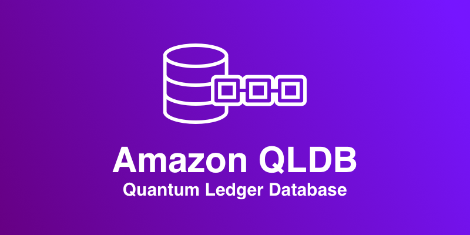
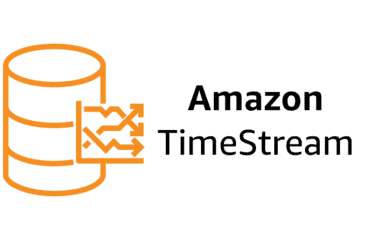
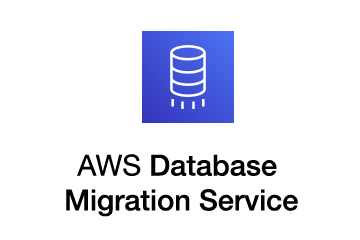

# AWS Database Management and Services:

In the dynamic landscape of cloud computing, effective data management is paramount for building robust, scalable, and highly available applications. The AWS Solutions Architect - Professional certification demands a deep understanding of how to choose, design, and implement the right database solutions for diverse and complex workloads. AWS offers a comprehensive suite of managed database services, freeing architects from the undifferentiated heavy lifting of traditional database administration, such as hardware provisioning, patching, backups, and scaling.

As an AWS Certified Solutions Architect, it’s crucial to understand how to choose the right database solution for a given workload, design for scalability and reliability, and leverage AWS-managed offerings to reduce operational complexity.

This section of the study guide will explore the various database options available on AWS, from traditional relational databases to purpose-built NoSQL and specialized databases. We will delve into the architectural considerations for selecting the appropriate service based on application requirements, including data model, consistency, availability, performance, scalability, and cost optimization. A key focus will be on designing resilient and performant data layers that integrate seamlessly with other AWS services.

This section provides an in-depth overview of AWS database services, helping you master the concepts needed to architect resilient, high-performance, and cost-effective data solutions in the cloud.

Understanding the nuances of each service and its optimal use cases is crucial for the Solutions Architect Professional. This includes not only knowing what each service does but also when and why to use it over another, considering factors like ACID compliance, eventual consistency, read/write patterns, and disaster recovery strategies.

# Important AWS Database Services:

The AWS ecosystem provides a rich array of database services, each designed to excel at specific data models and use cases. 

For the AWS Solutions Architect - Professional exam, a thorough understanding of the following services is essential:

* Amazon Relational Database Service(RDS)

* Amazon DynamoDB

* Amazon Redshift

* Amazon ElastiCache

* Amazon DocumentDB (with MongoDB compatibility)

* Amazon Neptune

* Amazon QLDB (Quantum Ledger Database)

* Amazon TimestreamAWS Database Migration Service (DMS)

## Amazon Relational Database Service (RDS):

  

A fully managed service that makes it easy to set up, operate, and scale a relational database in the cloud. RDS supports a variety of popular database engines, abstracting away the underlying infrastructure management.

**Type:** Managed Relational Database

**Supports:** MySQL, PostgreSQL, MariaDB, Oracle, SQL Server, and Amazon Aurora

**Use Cases:** Web and mobile apps, commercial databases

**Highlights:** Automated backups, patching, monitoring, Multi-AZ deployments, and read replicas.

**Key Engines:**

* **Amazon Aurora:**

    -  A MySQL and PostgreSQL-compatible relational database built for the cloud, offering performance and availability of commercial databases at a fraction of the cost. 

    - Aurora is a critical service to master, especially its read replicas, multi-master capabilities, and serverless options.

* **MySQL, PostgreSQL, MariaDB, Oracle, SQL Server:**

    -  Traditional relational databases managed by AWS, providing automated backups, patching, and scaling.

**Architectural Considerations:**

* ACID transactions and strong consistency.

* Multi-AZ deployments for high availability and automatic failover.

* Read Replicas for read scaling and disaster recovery.

* Integration with other AWS services like Amazon CloudWatch for monitoring, AWS KMS for encryption, and VPC for network isolation.

* Choosing the right instance size and storage type (e.g., GP2, io1).

## Amazon DynamoDB:

  

A fast, flexible NoSQL database service for single-digit millisecond performance at any scale. DynamoDB is a fully managed, serverless key-value and document database.

**Type:** Fully managed NoSQL database (key-value and document-based).

**Use Cases:** Real-time applications, gaming, IoT, mobile backends.

**Highlights:** Single-digit millisecond latency, auto-scaling, on-demand capacity, DynamoDB Streams, global tables.

**Architectural Considerations:**

* High-performance, low-latency applications (e.g., mobile, web, gaming, IoT).

* Flexible schema and eventual consistency (with options for strongly consistent reads).

* Auto-scaling capabilities to handle fluctuating workloads.

* Global Tables for multi-Region, multi-master replication for disaster recovery and low-latency global access.

* On-Demand or Provisioned Capacity modes.

* DynamoDB Streams for real-time data processing and integration with AWS Lambda.

* Time to Live (TTL) for automatic item expiration.

## Amazon Redshift:

  

A fully managed, petabyte-scale data warehouse service that makes it simple and cost-effective to analyze all your data using standard SQL and your existing business intelligence (BI) tools.

**Type:** Fully managed data warehouse

**Use Cases:** Analytics workloads, OLAP queries, business intelligence.

**Highlights:** Columnar storage, massively parallel processing (MPP), integration with Amazon S3 and Lake Formation.

**Architectural Considerations:**

* Analytics and business intelligence workloads.

* Columnar storage and massively parallel processing (MPP) for high-performance queries on large datasets.

* Choosing the right node type and cluster configuration.

* Concurrency scaling for handling sudden spikes in query load.

* Integration with other AWS analytics services like Amazon S3 (for Redshift Spectrum), Amazon Kinesis, and AWS Glue.

## Amazon ElastiCache:

  

A fully managed in-memory caching service that supports Memcached and Redis. It significantly improves application performance by retrieving information from fast in-memory caches instead of relying entirely on slower disk-based databases.

**Type:** In-memory caching service (Redis or Memcached).

**Use Cases:** Caching, session stores, real-time analytics.

**Highlights:** Ultra-low latency, high throughput, fully managed, replication and backup support.

**Architectural Considerations:**

* Reducing database load and improving response times for read-heavy workloads.

* Session management, leaderboards, real-time analytics.

* Choosing between Memcached (simple caching) and Redis (more features like data structures, persistence, pub/sub, replication).

* High availability and replication for Redis.

## Amazon DocumentDB (with MongoDB compatibility):

  

A fully managed document database service that supports MongoDB workloads. It allows you to store, query, and index JSON-like data.

**Type:** Document database.

**Use Cases:** Content management, catalog systems.

**Highlights:** Scalable, highly available, MongoDB API-compatible.

**Architectural Considerations:**

* Use cases requiring flexible, semi-structured data models (e.g., content management, catalogs, user profiles).

* Scalability and high availability for document-based workloads.

* Compatibility with existing MongoDB drivers and tools.

## Amazon Neptune:

  

A fast, reliable, fully managed graph database service that makes it easy to build and run applications that work with highly connected datasets.

**Type:** Fully managed graph database.

**Use Cases:** Social networking, recommendation engines, fraud detection.

**Highlights:** Supports both property graph (TinkerPop/Gremlin) and RDF (SPARQL) models.

**Architectural Considerations:**

* Fraud detection, social networking, recommendation engines, knowledge graphs.

* Storing and querying relationships between data entities.

* Supports popular graph query languages like Gremlin and SPARQL.

## Amazon QLDB (Quantum Ledger Database):

  

A fully managed ledger database that provides a transparent, immutable, and cryptographically verifiable transaction log owned by a central trusted authority.

**Type:** Ledger database.

**Use Cases:** Audit trails, supply chain, financial records.

**Highlights:** Immutable and cryptographically verifiable transaction logs.

**Architectural Considerations:**

* Applications requiring a complete and verifiable history of data changes (e.g., supply chain, financial transactions, registrations).

* Immutable data and cryptographic verification for data integrity.

## Amazon Timestream:

  

A fast, scalable, and serverless time series database service for IoT and operational applications that makes it easy to store and analyze trillions of events per day.

**Type:** Time-series database.

**Use Cases:** IoT applications, DevOps metrics, industrial telemetry.

**Highlights:** Optimized for time-series data, built-in data lifecycle management.

**Architectural Considerations:**

* IoT sensor data, application monitoring, industrial telemetry.

* Efficient storage and retrieval of time-stamped data.

* Automatic data tiering to optimize cost and performance.

## AWS Database Migration Service (DMS):

  

A service that helps you migrate databases to AWS quickly and securely. It supports homogeneous migrations (e.g., Oracle to Oracle) as well as heterogeneous migrations (e.g., Oracle to Amazon Aurora).

**Architectural Considerations:**

* Planning and executing database migrations with minimal downtime.

* Continuous data replication (CDC) for ongoing synchronization.

* Schema conversion using the AWS Schema Conversion Tool (SCT).

## 🎯 What You’ll Learn:

* Key differences between SQL vs NoSQL database types.

* How to choose the right AWS database service based on workload and access patterns.

* Designing for availability, durability, scalability, and cost optimization.

* Backup, monitoring, replication, and failover strategies.