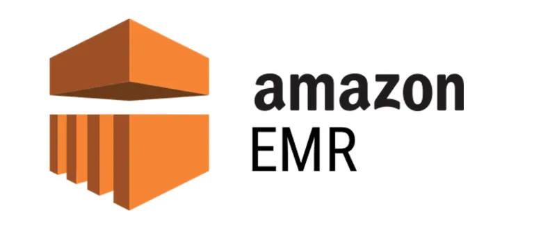

# Analytics and Big Data:

  

## Introduction to Analytics and Big Data on AWS:

Introduction to Analytics and Big Data on AWS
In today's data-driven world, the ability to collect, store, process, and analyze massive volumes of data (Big Data) is a critical competitive advantage for enterprises. The AWS Certified Solutions Architect - Professional exam emphasizes designing and implementing scalable, cost-effective, and secure Big Data and analytics solutions on the AWS cloud. This involves understanding the entire data lifecycle, from ingestion and storage to processing, analysis, and visualization.

Big Data is characterized by the "three Vs":

`Volume:` Enormous amounts of data.

`Velocity:` Data arriving at high speed, often requiring real-time processing.

`Variety:` Data coming in diverse formats, including structured, semi-structured, and unstructured data.

AWS provides a comprehensive and ever-evolving suite of managed services that address these challenges, allowing organizations to focus on extracting insights rather than managing underlying infrastructure. As a Solutions Architect Professional, you will be expected to architect solutions that leverage these services effectively, considering factors like data types, processing requirements (batch vs. real-time), latency needs, cost optimization, and integration with other AWS services. Building modern data architectures often revolves around the concept of a data lake, typically built on Amazon S3, which acts as a centralized repository for all data, allowing for flexible access and processing by various analytics services.

This section will cover the key AWS services involved in Big Data and analytics, their use cases, and how to combine them to create robust and efficient data pipelines.

## Important AWS Analytics and Big Data Services:

AWS offers a vast array of services for analytics and Big Data, each purpose-built for specific stages of the data pipeline or specific types of analysis. For the AWS Solutions Architect - Professional exam, a deep understanding of the following services is paramount:

* Amazon S3 (Simple Storage Service)

* Amazon Kinesis

* AWS Glue

* Amazon EMR (Elastic MapReduce)

* Amazon Athena

* Amazon Redshift

* Amazon QuickSight

* AWS Lake Formation

* Amazon OpenSearch Service (formerly Amazon Elasticsearch Service)

* AWS Data Pipeline

## Amazon Kinesis:

  

A family of services designed for processing streaming data in real-time. This is crucial for high-velocity data scenarios.

**Type:** Real-time data streaming platform

**Use Cases:** Real-time dashboards, anomaly detection, clickstream analysis

**Key Services:**

* **Amazon Kinesis Data Streams (KDS):** A highly scalable and durable real-time data streaming service. Ideal for custom applications that need to process and analyze streaming data for specialized needs, such as clickstream analysis, IoT telemetry, and log aggregation.

* **Amazon Kinesis Data Firehose:** A fully managed service for delivering real-time streaming data to destinations like Amazon S3, Amazon Redshift, Amazon OpenSearch Service, and Splunk. It handles batching, compression, and encryption before delivery, simplifying the data ingestion process.

* **Amazon Kinesis Data Analytics:** A simple way to analyze streaming data in real time with standard SQL or Apache Flink, allowing you to gain actionable insights and respond to business and customer needs promptly.

**Architectural Considerations:**

* Real-time processing and analysis of high-velocity data.

* Choosing the right Kinesis service based on processing complexity and destination requirements.

* Scaling shards in KDS to handle increasing throughput.

* Integration with AWS Lambda for event-driven processing.

## AWS Glue:

  

A fully managed extract, transform, and load (ETL) service that makes it easy to prepare and load your data for analytics.

**Type:** Serverless Data Integration and ETL Service

**Use Cases:** Data preparation, transformation, cataloging

**Highlights:** Built-in ETL jobs using Spark or Python, data catalog integration, Glue Studio for visual authoring.

**Key Features:**

* `AWS Glue Data Catalog:` A centralized metadata repository that stores schema and location information for your data. It acts as a unified metadata store for various AWS analytics services (Athena, EMR, Redshift Spectrum).

* `Glue Crawlers:` Automatically discover and infer schemas from your data sources and populate the Data Catalog.

* `Glue ETL Jobs:` Generate and run Apache Spark or Python Shell scripts for data transformation. Glue Studio provides a visual interface for creating ETL pipelines.

* `Glue Data Quality:` Helps in monitoring and improving the quality of your data.

**Architectural Considerations:**

* Serverless ETL processing, eliminating server management.

* Automated schema discovery and cataloging.

* Batch processing for data transformation and preparation.

* Integration with S3 for data lake operations.

## Amazon EMR (Elastic MapReduce):

  

A managed cluster platform that simplifies running big data frameworks like Apache Hadoop, Apache Spark, Apache Hive, and Presto on AWS.

**Type:** Big Data processing framework based on Apache Hadoop/Spark

**Use Cases:** Large-scale batch data processing, machine learning, ETL workloads

**Highlights:** Auto-scaling clusters, integration with S3, supports Hive, Pig, Presto, and more.

**Architectural Considerations:**

* Batch processing of large datasets.

* Flexible for complex data transformations and analytical workloads.

* Support for various open-source big data frameworks.

* Ability to scale clusters up and down based on demand for cost optimization (e.g., using Spot Instances).

* Integration with S3 for data storage, separating compute from storage.

## Amazon Athena:

  

An interactive query service that makes it easy to analyze data in Amazon S3 using standard SQL. It is serverless, so there is no infrastructure to manage.

**Type:** Serverless Interactive Query Service.

**Use Cases:** Ad-hoc querying of S3-based datasets.

**Highlights:** No infrastructure to manage, supports standard SQL, integrated with AWS Glue Data Catalog.

**Architectural Considerations:**

* Ad-hoc querying of data directly in S3.

* Serverless, pay-per-query model.

* Ideal for data exploration and reporting on data in your S3 data lake.

* Leverages the AWS Glue Data Catalog for schema information.

* Supports various data formats including CSV, JSON, Parquet, and ORC.

## Amazon Redshift:

  

A fully managed, petabyte-scale data warehouse service for large-scale data analytics.

**Type:** Fully managed, petabyte-scale data warehouse.

**Use Cases:** Business intelligence, data lake analytics, OLAP queries.

**Highlights:** Columnar storage, high-performance MPP engine, Redshift Spectrum for querying S3 data.

**Architectural Considerations:**

* High-performance analytical queries on structured data.

* Columnar storage and Massively Parallel Processing (MPP) architecture.

* Ideal for business intelligence, reporting, and complex analytical workloads.

* Redshift Spectrum allows querying data directly in S3 alongside data in Redshift.

* Choosing the right node type (dense compute vs. dense storage) and scaling options (concurrency scaling, elastic resize).

## Amazon QuickSight:

  

A cloud-powered business intelligence (BI) service that makes it easy to create and publish interactive dashboards, embed analytics, and get insights from your data.

**Type:** Business intelligence and visualization tool

**Use Cases:** Interactive dashboards, embedded analytics

**Highlights:** Serverless, SPICE engine for fast data queries, integration with Athena, Redshift, and RDS.

**Architectural Considerations:**

* Data visualization and dashboarding for end-users.

* Integration with various AWS data sources (S3, Redshift, Athena, RDS, Spark, etc.).

* SPICE (Super-fast Parallel In-memory Calculation Engine) for accelerated query performance.

* Machine learning-powered insights and natural language queries.

## AWS Lake Formation:

  

A service that helps you build, secure, and manage data lakes quickly. It simplifies the process of setting up secure data lakes by integrating with existing AWS analytics services.

**Type:** Data lake orchestration service.

**Use Cases:** Secure, centralized data lake setup and governance.

**Highlights:** Centralized data access controls, fine-grained security, automated data classification and import.

**Architectural Considerations:**

* Centralized security and governance for your data lake.

* Fine-grained access control to data in S3.

* Simplifies data ingestion, cleaning, transformation, and cataloging.

## Amazon OpenSearch Service (formerly Amazon Elasticsearch Service):

  

A fully managed service that makes it easy to deploy, secure, and run OpenSearch clusters at scale. It's often used for log analytics, real-time application monitoring, and full-text search.

**Type:** Search, log analytics, and observability platform

**Use Cases:** Full-text search, log aggregation, monitoring

**Highlights:** Integration with Kibana/OpenSearch Dashboards, scalable clusters, near real-time indexing.

**Architectural Considerations:**

* Search and analysis of semi-structured and unstructured data (e.g., logs, clickstreams).

* Real-time data ingestion and visualization.

* Scalability for handling large volumes of streaming data.

## AWS Data Pipeline:

  

**Type:** Business intelligence and visualization tool

**Use Cases:** Interactive dashboards, embedded analytics

**Highlights:** Serverless, SPICE engine for fast data queries, integration with Athena, Redshift, and RDS.

## 🎯 What You’ll Learn:

* Differences between real-time, batch, and interactive analytics.

* How to architect data lakes and data warehouses using AWS services.

* Design patterns for ETL/ELT pipelines.

* Data governance, cataloging, and access control.

* Cost optimization strategies for analytics workloads.

