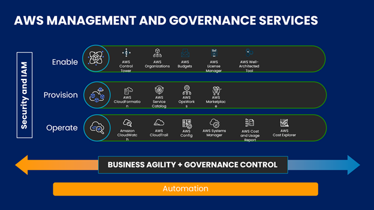
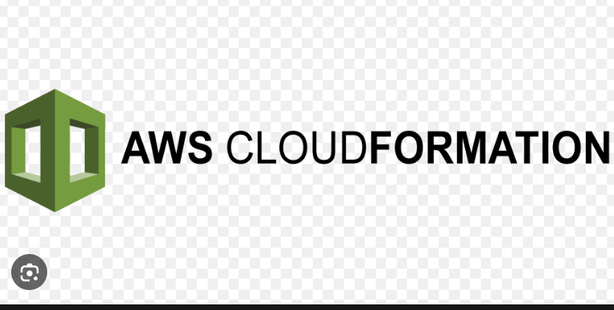
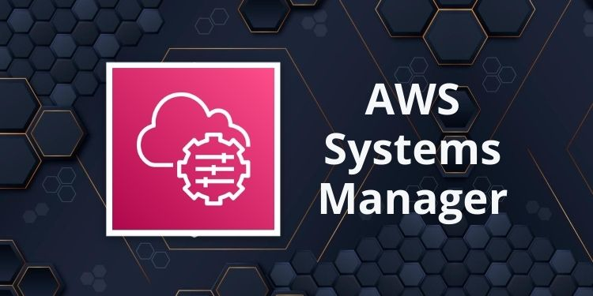
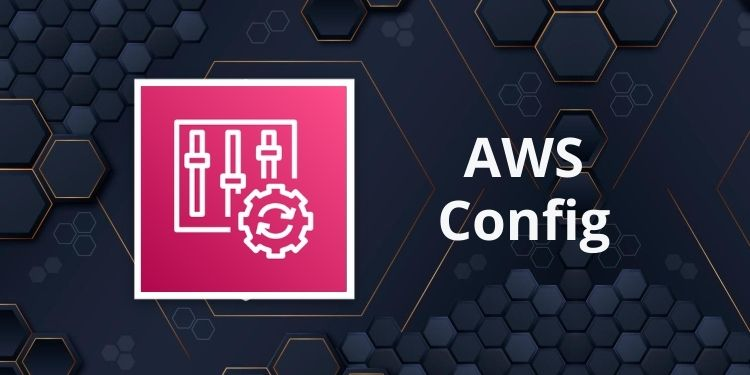
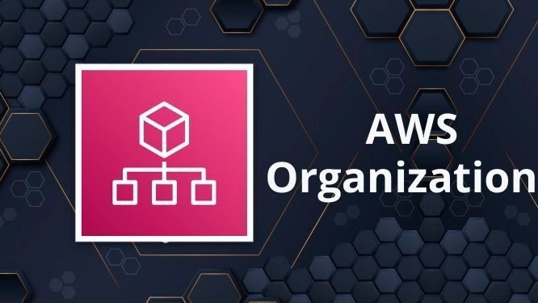
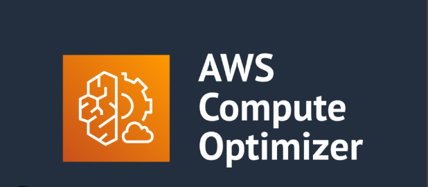
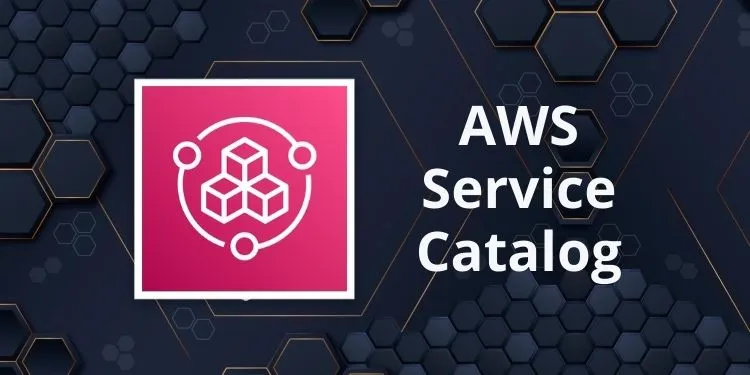
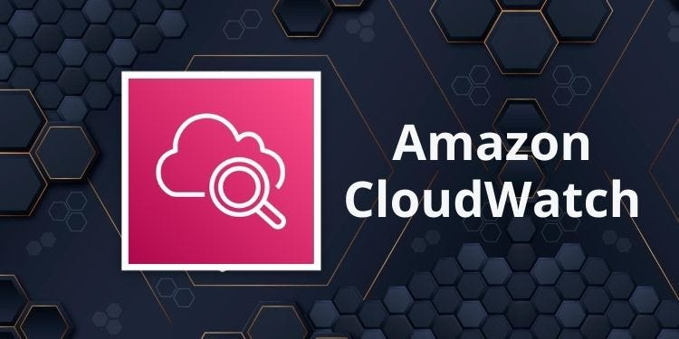
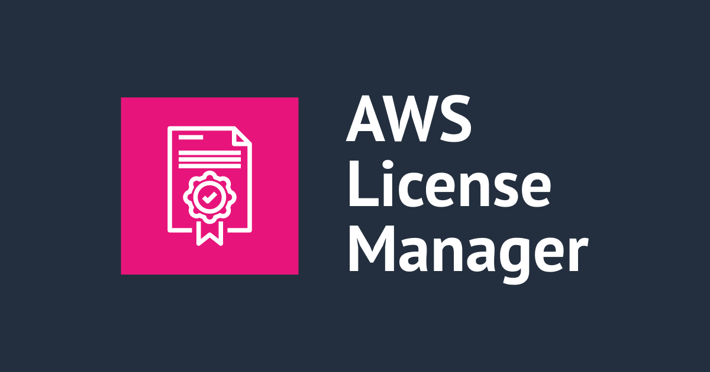

# AWS Management and Governance:

  

## Introduction to Management and Governance on AWS:

As organizations scale their cloud presence on AWS, effective management and governance become paramount. The AWS Certified Solutions Architect - Professional certification requires a deep understanding of how to design and implement solutions that not only leverage the vast array of AWS services but also ensure operational excellence, security, compliance, cost optimization, and efficient resource management across single and multi-account environments.

Management and Governance on AWS encompass a suite of services designed to help you:

* **Provision and manage resources:** Automate the deployment and configuration of your infrastructure.

* **Monitor and log activity:** Gain visibility into your AWS environment for auditing, security, and troubleshooting.

* **Enforce policies and compliance:** Ensure your resources adhere to organizational standards and regulatory requirements.

* **Optimize costs and performance:** Identify opportunities to reduce spending and improve efficiency.

* **Control access and identity:** Securely manage who can do what within your AWS accounts.

A well-architected cloud environment relies heavily on these capabilities to maintain control, reduce operational overhead, and mitigate risks. The Solutions Architect Professional must be adept at integrating these services to create a robust and automated governance framework.

This section introduces the key AWS services that help in managing, securing, monitoring, and optimizing your AWS infrastructure at scale.

## Important AWS Management and Governance Services:

AWS provides a comprehensive set of services to address the diverse needs of cloud management and governance. For the AWS Solutions Architect - Professional exam, a thorough understanding of the following services is crucial:

* AWS CloudFormation

* AWS Systems Manager

* AWS CloudTrail

* AWS Config

* AWS Organizations

* AWS Control Tower

* AWS Trusted Advisor

* AWS Compute Optimizer

* AWS Service Catelog

* AWS CLoudWatch

* AWS License Manager

* AWS Budgets

## AWS CloudFormation:

  

**Infrastructure as Code (IaC):** CloudFormation enables you to model your entire AWS infrastructure (and some on-premises resources) using declarative templates (JSON or YAML). It automates the provisioning and updating of resources as a single unit, called a stack.

**Type:** Infrastructure as Code (IaC).

**Use Cases:** Template-based resource provisioning and management.

**Highlights:** Declarative YAML/JSON templates, drift detection, StackSets for multi-account deployment.

**Architectural Considerations:**

* Automated, repeatable, and consistent infrastructure deployments.

* Version control for infrastructure.

* Drift detection to identify manual changes to resources outside of CloudFormation.

* StackSets for deploying common stacks across multiple accounts and regions.

* Integration with Service Catalog for controlled provisioning.

## AWS Systems Manager:

  

A unified interface that provides visibility and control over your AWS infrastructure. Systems Manager helps you automate operational tasks across your AWS resources, including EC2 instances, on-premises servers, and virtual machines.

**Type:** Unified operational control hub.

**Use Cases:** Patch management, inventory, automation, run commands.

**Highlights:** Secure hybrid infrastructure management, Automation documents (SSM docs), Session Manager for shell access.

**Key Capabilities:**

* `Run Command:` Securely execute commands on fleets of instances.

* `Patch Manager:` Automate the patching of operating systems and applications.

* `Session Manager:` Secure and auditable access to instances without SSH keys or bastion hosts.

* `State Manager:` Define and maintain desired configuration states for your instances.

* `Parameter Store:` Securely store and retrieve configuration data and secrets.

* `Automation:` Automate common IT operations tasks.

**Architectural Considerations:**

* Centralized management and automation of hybrid environments.

* Reducing manual operational tasks and improving compliance.

* Secure remote access and command execution.

## AWS CloudTrail:

  

A service that enables governance, compliance, operational auditing, and risk auditing of your AWS account. CloudTrail records user activity and API calls across AWS services as events.

**Type:** Governance and compliance.

**Use Cases:** Track user activity and API usage.

**Highlights:** Continuous logging of account activity, integration with CloudWatch and S3, auditing support.

**Architectural Considerations:**

* Logging of all management and data events for auditing and security.

* Event history for troubleshooting "who did what, when, and where."

* Delivery of logs to S3 for long-term archival and analysis.

* Integration with CloudWatch Logs for real-time monitoring and alerting.

* CloudTrail Lake for advanced analytics and immutable storage of audit logs.

* Organization trails for centralized logging across all accounts in an AWS Organization.

## AWS Config:

  

A service that enables you to assess, audit, and evaluate the configurations of your AWS resources. AWS Config continuously monitors and records your AWS resource configurations and allows you to automate the evaluation of recorded configurations against desired configurations.

**Type:** Resource configuration compliance and monitoring.

**Use Cases:** Evaluate resource configurations, track changes, audit compliance.

**Highlights:** Record configuration history, define custom rules, automatic remediation.

**Architectural Considerations:**

* Continuous compliance monitoring against predefined or custom rules.

* Configuration history for auditing and rollback.

* Tracking relationships between resources.

* Remediation actions for non-compliant resources.

* Identifying configuration drift and ensuring security best practices.

## AWS Organizations:

  

A service that helps you centrally manage and govern your environment as you grow and scale your AWS resources. Using Organizations, you can consolidate multiple AWS accounts into a single organization, making it easier to manage your resources.

**Type:** Account and policy management.

**Use Cases:** Multi-account structure, consolidated billing, service control policies (SCPs).

**Highlights:** Centralized management, policy-based controls, integration with Control Tower.

**Architectural Considerations:**

* Consolidated billing for all accounts.

* Service Control Policies (SCPs) to enforce maximum permissions for accounts within an Organizational Unit (OU).

* Programmatic account creation and management (Account Factory).

* Centralized management of security, compliance, and resource sharing across accounts.

* Best practice for creating multi-account environments (e.g., separating Dev/Test/Prod).

## AWS Control Tower:

  

A managed service that simplifies the setup and governance of a new, secure, multi-account AWS environment (a "landing zone") based on AWS best practices. Control Tower orchestrates multiple AWS services to achieve this.

**Type:** Landing zone automation.

**Use Cases:** Quickly set up secure, multi-account environments with governance.

**Highlights:** Automated guardrails, account factory, lifecycle management for accounts.

**Architectural Considerations:**

* Automated landing zone setup for multi-account environments.

* Built-in guardrails (preventive and detective) for continuous compliance.

* Centralized logging and auditing.

* Integrated identity management with IAM Identity Center (AWS SSO).

* Automated account provisioning (Account Factory) with pre-configured baselines.

## AWS Trusted Advisor:

  

An online resource that helps you reduce cost, increase performance, and improve security by optimizing your AWS environment. Trusted Advisor provides real-time, actionable insights based on AWS best practices.

**Type:** Best practice recommendations

**Use Cases:** Cost optimization, security checks, performance tuning

**Highlights:** Five core checks (free tier), full checks with Business/Enterprise Support.

**Architectural Considerations:**

* Continuous analysis across five pillars: Cost Optimization, Performance, Security, Fault Tolerance, Operational Excellence, and Service Limits.

* Proactive recommendations for improving your AWS posture.

* Useful for identifying underutilized resources, security vulnerabilities, and service limit breaches.

## AWS Compute Optimizer:

  

A machine learning-powered service that recommends optimal AWS resources for your workloads to reduce costs and improve performance.

**Architectural Considerations:**

* Optimizing EC2 instances, EBS volumes, Lambda functions, and ECS on Fargate.

* Identifying over-provisioned or under-provisioned resources.

* Data-driven recommendations for right-sizing and cost savings.

## AWS Service Catalog:

  

Enables organizations to create and manage catalogs of IT services that are approved for use on AWS. It helps achieve consistent governance and meet compliance requirements by allowing end-users to deploy only approved IT services.

**Architectural Considerations:**

* Standardized and controlled provisioning of AWS resources for end-users.

* Centralized management of IT services and products (e.g., pre-configured EC2 instances, databases, or entire application stacks).

* Enforcing compliance and security policies through predefined product configurations.

* Integration with CloudFormation for defining products.

## AWS CloudWatch:

  

A monitoring and observability service that provides data and actionable insights to monitor your applications, respond to system-wide performance changes, and optimize resource utilization. It collects monitoring and operational data in the form of logs, metrics, and events.

**Type:** Monitoring and observability.

**Use Cases:** Metric collection, logs, alarms, dashboards.

**Highlights:** Custom metrics, event-driven automation, integration with Lambda and Auto Scaling.

**Architectural Considerations:**

* Real-time monitoring of AWS resources and applications.

* Centralized collection and analysis of logs from various sources (CloudWatch Logs).

* Custom metrics for application-specific monitoring.

* Setting alarms and automated actions (e.g., scaling, notifications) based on thresholds.

* Creating dashboards for a unified operational view.
* Anomaly detection for proactive issue identification.

## AWS License Manager:

  

A service that helps you manage your software licenses from various software vendors (e.g., Microsoft, SAP, Oracle, IBM) across AWS and on-premises environments. It simplifies license tracking, ensures compliance, and helps optimize license usage.

**Type:** License tracking and compliance.

**Use Cases:** Manage and track usage of software licenses.

**Highlights:** License counting, enforcement, alerting, integration with Systems Manager.

**Architectural Considerations:**

* Centralized visibility and control over software licenses.

* Preventing licensing overages and reducing the risk of non-compliance.

* Automating the discovery of software running on EC2 instances using Systems Manager.

* Managing licenses that require dedicated hardware (e.g., EC2 Dedicated Hosts).

* Integration with EC2 launch for enforcing license rules.

## AWS Budgets:

  

A service that allows you to set custom budgets to track your costs and usage from the simplest to the most complex spending patterns. You can create budgets for costs, usage, or Reserved Instance and Savings Plans utilization and coverage.

**Type:** Cost and usage monitoring.

**Use Cases:** Set spending limits, receive budget alerts.

**Highlights:** Budget forecasts, customizable notifications, integration with Cost Explorer.

**Architectural Considerations:**

* Proactive cost monitoring and alerting.

* Setting thresholds for actual and forecasted spending.

* Receiving notifications via SNS when budget thresholds are breached.

* Creating budget actions to automatically apply policies or stop instances when thresholds are met.

* Granular budgeting by service, linked account, tag, and more.

## 🎯 What You’ll Learn:

* Designing secure and governed multi-account architectures.

* Automating infrastructure and resource compliance.

* Centralized operations and monitoring with Systems Manager and CloudWatch.

* Controlling access, auditing usage, and optimizing costs.

* Leveraging IaC for consistent, repeatable deployments.

