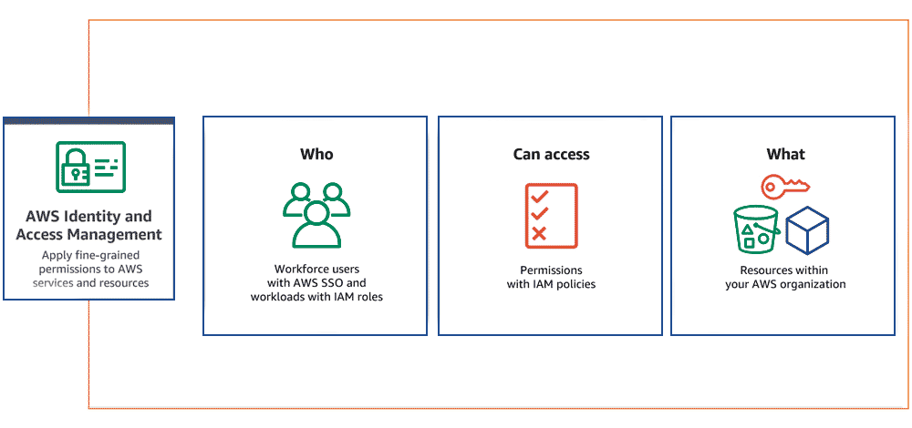
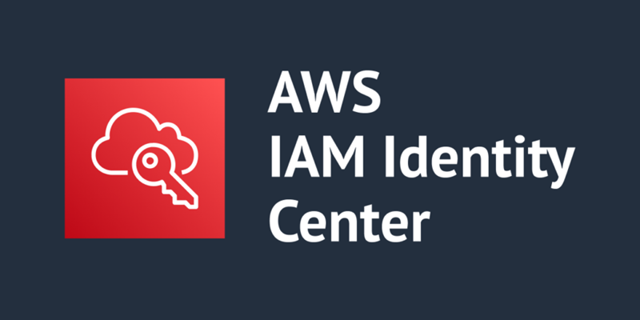
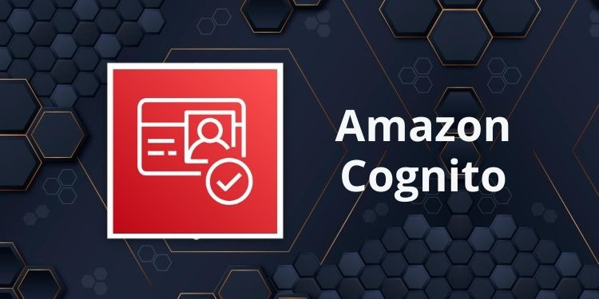
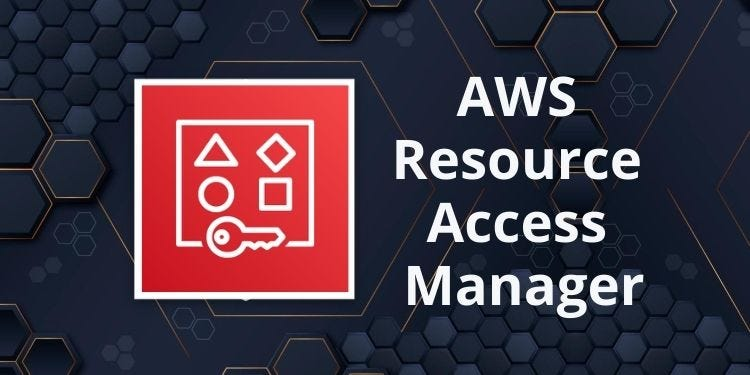
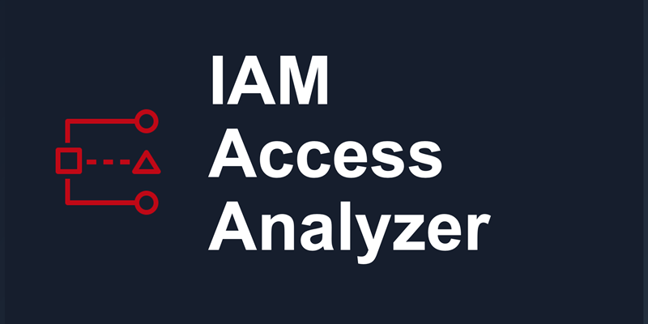

# 📘 AWS Identity and Access Solutions:

  

Security is a foundational pillar of the AWS Well-Architected Framework, and at its core lies robust Identity and Access Management (IAM). For the AWS Certified Solutions Architect - Professional, a comprehensive understanding of how to design and implement secure identity and access solutions is not just important—it's critical. This involves controlling who (or what) can access which AWS resources, under what conditions, and ensuring that access is granted based on the principle of least privilege.

In a large, complex enterprise environment, managing identities and permissions can be challenging. AWS provides a suite of services that enable architects to manage both human users (workforce identities) and machine identities (workload identities), integrate with existing on-premises identity systems, and enforce granular access policies across multiple AWS accounts. The goal is to create a secure and compliant environment while maintaining operational efficiency and flexibility for developers and users.

This section will delve into the core concepts of identity and access management on AWS, exploring the various services, their interplay, and best practices for designing a secure and scalable access control strategy. This includes understanding authentication (verifying identity) and authorization (granting permissions).

## Important AWS Identity and Access Services:

The AWS Identity and Access portfolio is extensive, covering everything from fundamental user management to advanced federation and access analysis. For the AWS Solutions Architect - Professional exam, a deep dive into the following services is essential:

* AWS Identity and Access Management (IAM)

* AWS Security Token Service (STS)

* AWS IAM Identity Center (Successor to AWS Single Sign-On - AWS SSO)

* AWS Directory Service

* Amazon Cognito

* AWS Resource Access Manager (RAM)

* AWS IAM Access Analyzer

* AWS Organizations + Service Control Policies (SCPs)

## AWS Identity and Access Management (IAM):

  

  

The cornerstone of AWS security, IAM allows you to securely control access to AWS services and resources. It defines who can be authenticated (users, roles) and authorized (permissions) to use resources.

**Type:** Core service for access control.

**Use Cases:** User and role-based access, policy enforcement.

**Highlights:** Users, groups, roles, managed/custom policies, IAM conditions, MFA, trust policies.

**Key Components & Architectural Considerations:**

* **IAM Users:** Long-term credentials for individual human users or applications. Best practice dictates avoiding IAM users for applications running on EC2.

* **IAM Groups:** Collections of IAM users. Permissions are applied at the group level to simplify management.

* **IAM Roles:** Secure way to grant permissions to entities that you trust. Roles are temporary credentials that can be assumed by AWS services, EC2 instances, or federated users.

* **IAM Policies:** JSON documents that define permissions.

* **Authentication Mechanisms:** Passwords, Access Keys (for programmatic access), Multi-Factor Authentication (MFA).

* **Least Privilege:** Granting only the permissions required to perform a task.

* **Shared Responsibility Model:** Understanding your responsibilities vs. AWS's in security.

## AWS Security Token Service (STS):

  

A web service that enables you to request temporary, limited-privilege credentials for IAM users or for users that you authenticate (federated users).

**Type:** Temporary credential issuance.

**Use Cases:** Assume roles, cross-account access, federated identity access.

**Highlights:** Secure delegation, short-term credentials, integration with IAM roles and identity providers.

**Architectural Considerations:**

* `AssumeRole:` Fundamental API call for assuming an IAM role, often used by EC2 instances, federated users, or cross-account access.

* `AssumeRoleWithWebIdentity:` For web or mobile applications to authenticate users via web identity providers (e.g., Amazon Cognito, Facebook, Google).

* `AssumeRoleWithSAML:` For integrating with on-premises identity providers that support SAML 2.0 (e.g., Active Directory Federation Services - ADFS).

* `GetFederationToken:` For distributing temporary credentials to users outside of AWS who don't have IAM users.

* Enabling temporary, time-limited access, enhancing security by reducing reliance on long-term credentials.

## AWS IAM Identity Center (Successor to AWS Single Sign-On - AWS SSO):

  

A cloud SSO service that makes it easy to centrally manage access to multiple AWS accounts and business applications. It provides a single point of access for users to all their assigned accounts and applications.

**Type:** Centralized access management.

**Use Cases:** Single sign-on to AWS accounts and cloud applications.

**Highlights:** Integration with Active Directory, SAML-based federation, fine-grained access assignments, centralized dashboard.

**Architectural Considerations:**

* Centralized workforce identity management across multiple AWS accounts in an AWS Organization.

* Integration with external identity providers (e.g., Active Directory, Azure AD, Okta, Ping Identity) using SAML 2.0.

* Provisioning and managing access to AWS accounts and integrated SaaS applications.

* Attribute-Based Access Control (ABAC) capabilities for fine-grained permissions based on user attributes.

* Simplified user experience with a unified access portal.

## AWS Directory Service:

  

A managed service that allows you to connect your AWS resources to an existing on-premises Microsoft Active Directory or to set up a new, standalone directory in the AWS cloud.

**Key Types:**

* **AWS Managed Microsoft AD:** A managed Active Directory for your AWS applications and workloads. Supports standard AD features like Group Policy, trusts, and Kerberos.

* **AD Connector:** A proxy service that allows your AWS applications to use your on-premises Active Directory without syncing. It forwards requests to your on-premises AD.

* **Simple AD:** A standalone, managed directory powered by Samba 4 compatible with Active Directory, suitable for smaller workloads or Linux-based applications.

**Architectural Considerations:**

* Integrating existing enterprise identities with AWS.

* Enabling SSO for Windows-based workloads on AWS.

* Centralized authentication and authorization for hybrid environments.

* Choosing the appropriate Directory Service type based on integration needs and scale.

## Amazon Cognito:

  

A service that provides authentication, authorization, and user management for your web and mobile applications. It scales to millions of users and supports sign-in with social identity providers (Google, Facebook, Amazon) and enterprise identity providers (SAML, OpenID Connect).

**Key Components:**

* **User Pools:** Secure user directories that provide sign-up and sign-in options for your application users.

* **Identity Pools (Federated Identities):** Enable you to grant your users temporary AWS credentials to access AWS services (e.g., S3, DynamoDB) directly from your application.

* **Sync Data:** Synchronizes user profile data across devices.

**Architectural Considerations:**

* Managing customer-facing identities for applications.

* Integrating with various social and enterprise identity providers.

* Providing secure, temporary AWS credentials to application users.

* Implementing user authentication and authorization for serverless and mobile applications.

## AWS Resource Access Manager (RAM):

  

A service that enables you to easily and securely share your AWS resources with any AWS account or within your AWS Organization. This helps reduce operational overhead by avoiding resource duplication.

**Type:** Cross-account resource sharing

**Use Cases:** Share VPCs, Transit Gateways, Route 53 Zones, etc.

**Highlights:** Secure, auditable resource sharing without full account access.

**Architectural Considerations:**

* Sharing VPC subnets, AWS Transit Gateways, AWS License Manager configurations, EC2 Capacity Reservations, and other resources across accounts.

* Centralizing resource management and reducing the need for cross-account roles in many scenarios.

* Simplifying multi-account architectures by sharing common infrastructure components.

## AWS IAM Access Analyzer:

  

A feature that helps you identify resources in your organization and accounts, such as S3 buckets or IAM roles, that are shared with an external entity. It helps you identify unintended access to your resources.

**Architectural Considerations:**

* Proactive security analysis to identify external access.

* Ensuring least privilege by continuously monitoring and reporting on potential over-permissive policies.

* Generating least-privilege policies based on CloudTrail access activity.

## 🎯 What You’ll Learn:

* IAM principles: Authentication vs Authorization, Users vs Roles

* Best practices for least privilege and access segmentation

* Federation and SSO with third-party identity providers

* Managing cross-account and temporary access

* Audit, governance, and compliance in access controls

